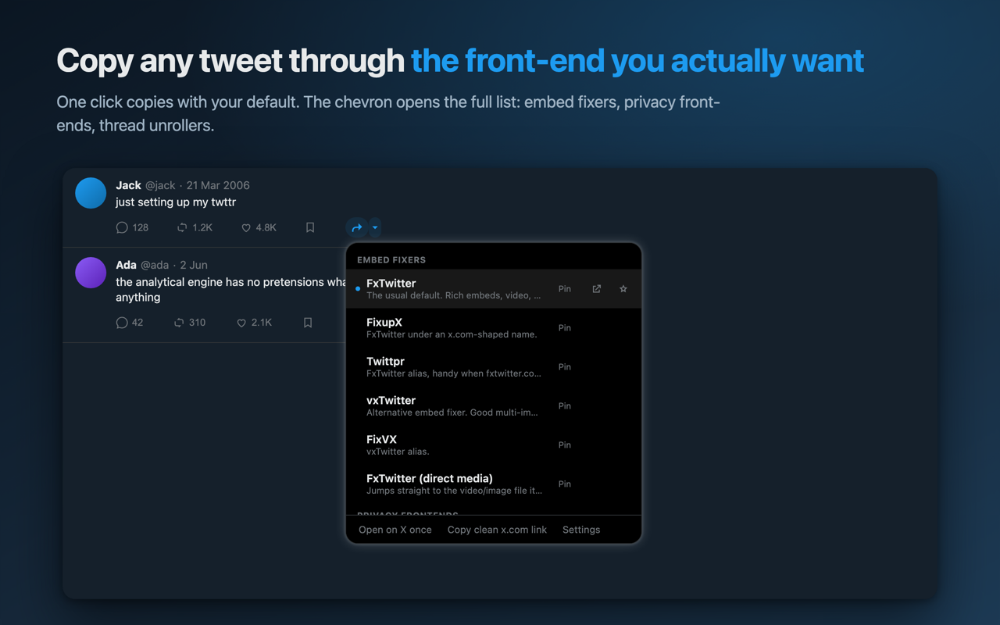
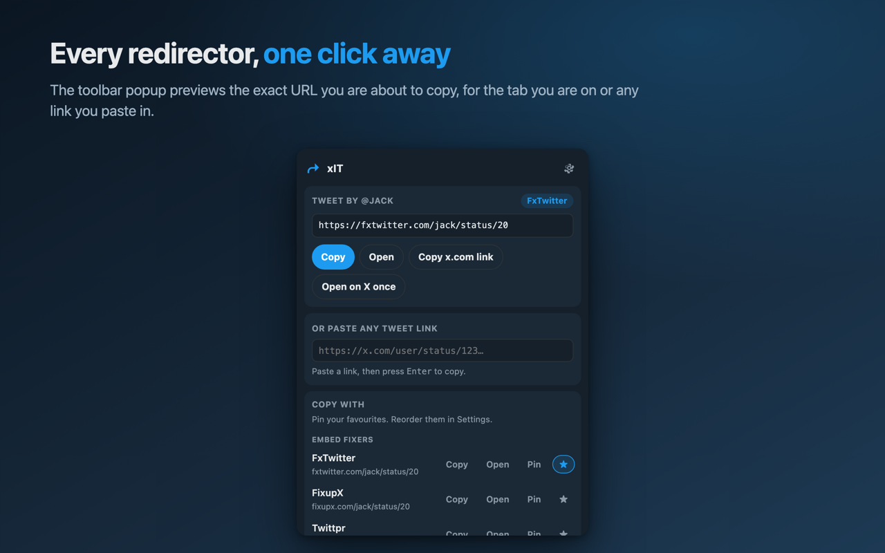
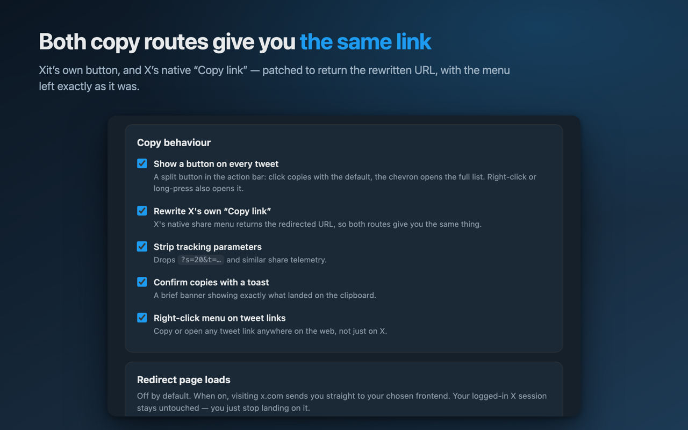
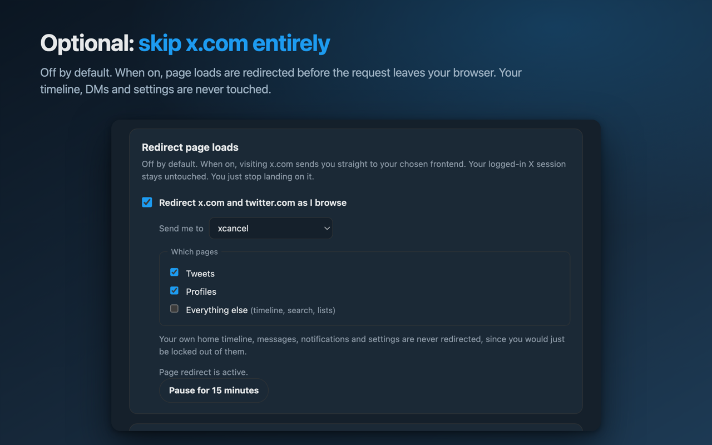
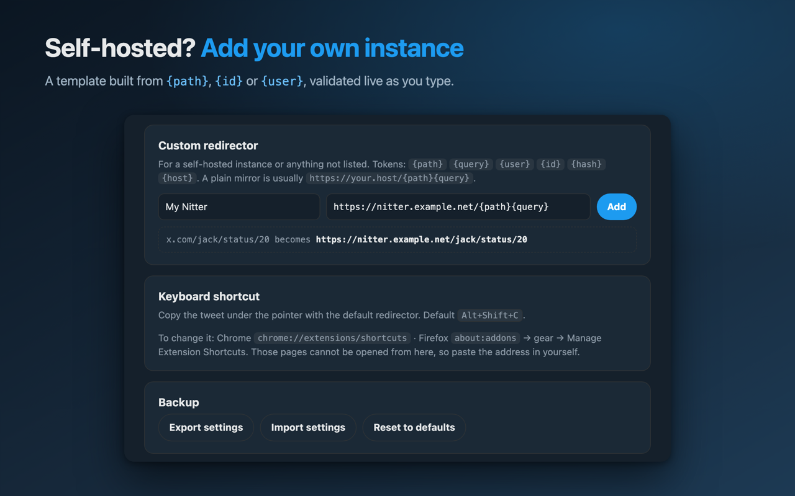

# xIT

[](https://chromewebstore.google.com/detail/xit/clilllbfkoeamfonhoeaaepglgceanlc)
[](LICENSE)

**[Install from the Chrome Web Store](https://chromewebstore.google.com/detail/xit/clilllbfkoeamfonhoeaaepglgceanlc)**

A Chrome and Firefox extension that copies X/Twitter links through a redirector
of your choice: `fxtwitter` by default, or any of the bundled privacy
frontends, thread unrollers, or your own self-hosted instance.

Both copy routes give you the same rewritten link:

- **The button on every tweet.** Click it to copy with your default; click the
  chevron (or right-click, or long-press) to pick a different one for that copy.
- **X's own "Copy link".** The native share menu is patched so it returns the
  redirected URL too, with no change to how the menu looks or behaves.

Plus a right-click menu on any tweet link anywhere on the web, an optional
browse redirect, and a keyboard shortcut.



## What it does

**Pick a redirector once, or per copy.** The split button sits in the tweet
action bar. A click copies with your default. The chevron opens the full list,
grouped by what each one is for.

**Both copy routes agree.** X's own "Copy link" is patched to hand back the
same rewritten URL, so whichever route your muscle memory takes, you get the
same thing. The native menu looks and behaves exactly as it did.

**Tidier links.** The `?s=20&t=...` share telemetry X appends is stripped by
default, while real parameters are left alone.

<table>
  <tr>
    <td width="50%"></td>
    <td width="50%"></td>
  </tr>
  <tr>
    <td>The popup previews the exact URL you are about to copy, for the current tab or any link you paste in.</td>
    <td>Every part of the copy behaviour is switchable, including the patch on X's native menu.</td>
  </tr>
  <tr>
    <td width="50%"></td>
    <td width="50%"></td>
  </tr>
  <tr>
    <td>Optional page redirecting, scoped to tweets, profiles, or everything. Off by default.</td>
    <td>Custom templates for a self-hosted instance, validated live as you type.</td>
  </tr>
</table>

### What's built in

| Group | Redirectors | For |
|---|---|---|
| Embed fixers | fxtwitter, fixupx, twittpr, vxtwitter, fixvx, d.fxtwitter | Tweets that unfurl properly in Discord, Slack and Signal |
| Privacy front-ends | xcancel, twiiit, nitter.net, nitter.poast.org, nitter.privacydev.net | Reading without tracking or a login wall |
| Thread tools | Thread Reader App, Unroll Now | Unrolling a long thread into one page |
| Custom | yours | Self-hosted instances, anything not listed |

## Install

[**Get it on the Chrome Web Store**](https://chromewebstore.google.com/detail/xit/clilllbfkoeamfonhoeaaepglgceanlc)

Works in Chrome, Edge, Brave and any other Chromium browser that accepts Web
Store installs.

Firefox is not published yet. Build it and load it yourself, per
[building from source](#building-from-source) below.

### Building from source

```bash
npm run prepare-dist
```

That writes `dist/chrome/` and `dist/firefox/` (and a `.zip` of each). No npm
dependencies are installed, since the project has none.

**Chrome / Edge / Brave**: go to `chrome://extensions`, turn on *Developer
mode*, click *Load unpacked*, pick `dist/chrome`.

**Firefox**: go to `about:debugging#/runtime/this-firefox`, click *Load
Temporary Add-on*, pick `dist/firefox/manifest.json`. Temporary add-ons are
dropped on restart; for a permanent install you need a signed build via
[addons.mozilla.org](https://addons.mozilla.org/developers/).

On Firefox, MV3 host permissions are opt-in: open the extension's popup and use
**Grant access to x.com** the first time, then reload your X tab.

### Testing it

Load `dist/chrome`: the folder, not the zip, and not `src/` (the manifest is
generated into `dist/` at build time, so `src/` on its own will not load).

After changing any code: rebuild, press the **reload** arrow on the extension's
card, then reload your X tab. Content scripts only re-inject on a fresh page
load, so skipping that second step is the usual reason a change appears to do
nothing.

Where the logs are:

| What | Where to look |
|---|---|
| Content script (button, dropdown, toast) | DevTools console on the x.com tab |
| Background (context menus, redirect rules, shortcut) | `chrome://extensions` → the card → **service worker** |
| Popup / options page | Right-click the popup → Inspect |
| Load or manifest failures | The red **Errors** button on the card |

The service worker going idle is normal, not a fault; it wakes on demand.

**Public instances come and go.** Nitter instances in particular go dark without
warning. Settings has a *Check which are reachable* button, but it only proves
the host answered, not that it still renders tweets. If your default stops
working, switch it, or add your own instance under **Custom redirector**.

## Custom templates

A template is a URL with tokens filled in from the original link:

| Token | From `https://x.com/jack/status/20?s=20` |
|---|---|
| `{path}` | `jack/status/20` |
| `{query}` | `` (empty, `s=20` is stripped as tracking) |
| `{user}` | `jack` |
| `{id}` | `20` |
| `{hash}` | `` |
| `{host}` | `x.com` |

A plain mirror is `https://your.host/{path}{query}`. Something that only handles
single tweets is more like `https://your.host/tweet/{id}`. Templates built from
`{id}` are automatically refused for profile links rather than producing a
broken URL.

## Browse redirect

Off by default. When on, loading `x.com` sends you to your chosen frontend
before the page is fetched (via `declarativeNetRequest`, so x.com never loads
and never sees the request).

Scope is per page type (tweets, profiles, everything else), and your own home
timeline, messages, notifications, bookmarks and settings are **never**
redirected, since a frontend cannot show them and you would just be locked out.
Your logged-in X session is untouched; you simply stop landing on it.

Settings and the popup report whether the rules are active or an update failed.
If a new configuration cannot be installed, xIT removes its old rules and reports
the error. A separate context-menu error does not prevent redirect removal.

Use **Open on X once** in the popup, tweet dropdown, or right-click menu to open
the original page while keeping your redirect settings. It uses a one-time
`xit_bypass=1` parameter, which xIT removes from the address bar after loading.

**Pause for 15 minutes** temporarily stops page redirects. The popup and Settings
show the resume time, and the toolbar icon displays `PAUSE`. **Resume now** ends
the pause early. Copy rewriting remains available. The extension restores the
resume alarm after a background restart and checks the saved expiry after sleep
or browser restart.

## Everyday controls

- **Pin** a redirector in Settings, the popup, or the tweet dropdown to put it
  first. **Move up** and **Move down** in Settings order the pinned entries.
  Pins share one order across both copy lists; the star still selects a default.
- **Edit** a custom redirector without losing its enabled state, pin, or default
  selections. **Duplicate** creates a separate enabled entry. **Undo removal**
  restores the last deleted custom entry, including its selections, unless you
  changed those selections after deleting it. Undo survives closing Settings
  but is cleared by browser restart, reset, import, or the next removal.
- Paste a link in the popup and press **Enter** to copy the previewed URL. The
  paste field receives focus when the current tab has no usable X link.
- **Check this host** checks one enabled redirector. **Check which are reachable**
  checks all enabled entries. Results show the check time and remain visible
  while that Settings page is open. A responding server may still fail to show
  tweets; these checks do not inspect tweet content.
- **Copy diagnostics** in the popup or Settings copies versions, X access,
  redirect and menu status, and whether the content script responds in an open
  X tab. The report excludes tweet URLs, custom templates, clipboard contents,
  raw errors, and browsing history. Settings also displays the report for
  inspection or manual copying.

## Keyboard shortcut

`Alt+Shift+C` copies the tweet under the pointer (or the one in view) with the
default redirector. Rebind it at `chrome://extensions/shortcuts`, or in Firefox
at `about:addons` → gear → *Manage Extension Shortcuts*. Browsers do not let a
page link to those addresses, so paste them in yourself.

## Permissions, and why

| Permission | Why |
|---|---|
| `storage` | Your settings. Local only. |
| `contextMenus` | The right-click menu. |
| `activeTab` + `scripting` | Writing to the clipboard when you use the right-click menu on a page where the content script is not running. Granted per click, not standing. |
| `declarativeNetRequest` | The browse redirect. Rules are evaluated by the browser; the extension never sees your browsing. |
| `clipboardWrite` | Copying. |
| `alarms` | Resume page redirects when a requested pause expires. |
| Host access to x.com / twitter.com | The button, and reading the tweet permalink. |
| Optional host access | Requested for the selected redirect destination when enabling browse redirect, or for the enabled redirectors when starting a reachability check. No destination access is granted at installation. |

No analytics, no network requests of its own, no remote code. The only outbound
request it ever makes is the reachability check, and only when you press that
button.

## Development

```bash
npm test                 # URL parsing, templates, generated redirect rules
npm run icons            # regenerate src/icons/*.png
npm run build            # dist/chrome + dist/firefox + zips
npm run prepare-dist     # icons + build, in one go
npm run store-assets     # store screenshots and promo tiles (needs Chrome)
```

Run the native Chrome regression checks after building:

```bash
npm run test:browser
npm run test:firefox
npm run test:qol
```

The browser checks need Playwright and its full Chromium browser installed in
your development environment. If Playwright is outside this project, set
`PLAYWRIGHT_PATH` to its `index.mjs`; set `CHROME_PATH` to override the browser
executable. Use Chromium or Chrome for Testing, which support loading an unpacked
extension from the command line. The check uses a disposable profile, synthetic
X pages, and captured clipboard writes. Results are written to the ignored
`.harness/browser-results.json` file.

These checks exercise the browser's regex compiler, installed redirect rules,
settings writes from separate pages, keyboard actions, permission denial,
redirect failures, legacy data cleanup, and DOM updates. JavaScript regex tests
alone do not establish that Chrome can install a rule.

The Firefox check uses a recent Firefox release with WebDriver BiDi extension
installation support and Node 22 or later. Set `FIREFOX_PATH` if Firefox is not
in its standard macOS or Linux location. It checks temporary installation,
native settings messaging, menu creation, rule installation and removal, and
the Settings status display in a disposable profile. Results are written to
`.harness/firefox-results.json`. It does not exercise Firefox's content script
against authenticated X pages or validate a signed Store package.

`test:qol` uses the same Playwright setup as `test:browser`. It exercises the
new controls through native Chrome APIs and writes `.harness/qol-results.json`.
It includes a real resume-alarm event, undo through session storage, one-time
bypass navigation on synthetic X pages, and diagnostics with injected private
test strings to check that the report excludes them.
For API-created tabs, the test captures the requested URL and navigates after
the browser automation attaches its request handler, keeping the fixture local.

Settings mutations run through one background writer. Individual list and scope
changes are merged there against current settings, so concurrent pages cannot
replace one another's unrelated changes. The content observer scans affected
articles; unrelated page mutations do not trigger full-document scans.

One source tree in `src/` builds both browsers; `tools/build.mjs` generates the
two manifests, which differ only in the background-script style and the
Firefox add-on id.

Store screenshots are rendered by headless Chrome from the *real* popup, options
page and content script, with only the extension APIs stubbed, so they cannot
drift from the shipped UI. See [`store/SUBMISSION.md`](store/SUBMISSION.md).

```
src/
  lib/redirectors.js   presets, URL parsing, templates, redirect-rule compiler
  lib/storage.js       settings, defaults, normalisation
  background.js        context menus, redirect rules, shortcut
  content/inject.js    the button, dropdown, toast          (isolated world)
  content/main-world.js  wraps navigator.clipboard          (main world)
  popup/  options/     UI
```

`content/main-world.js` is the only part that runs in the page's own JS context,
and only so it can wrap `navigator.clipboard`. It holds no extension privileges,
never touches anything but a lone tweet URL (prose and plain text are passed
through untouched), and talks to the rest over `postMessage`.

### Known limits

- The in-tweet button depends on X's DOM. X ships layout changes regularly; if
  the button disappears, the selector in `isTweetActionBar` is the place to look.
  The native "Copy link" hijack does not depend on the DOM and will keep working.
- `world: "MAIN"` content scripts need Chrome 111+ / Firefox 128+. On older
  builds the extension falls back to intercepting the "Copy link" menu item
  directly, which is more fragile but functional.
- Firefox temporary add-ons disappear on restart.

## Handoff

[HANDOFF.md](HANDOFF.md) has the current release state, the decisions already
made and why, and the traps worth knowing before changing anything.

## Publishing

Listing copy, permission justifications and generated artwork for both stores
live in [`store/`](store/):

- [`store/SUBMISSION.md`](store/SUBMISSION.md): what to do, in order
- [`store/chrome-web-store.md`](store/chrome-web-store.md): Chrome fields
- [`store/firefox-amo.md`](store/firefox-amo.md): AMO fields

## Privacy

No analytics, no telemetry, no accounts, no remote code. xIT makes no network
requests of its own except the optional reachability check you trigger by hand.
Full text: [PRIVACY.md](PRIVACY.md).

## Licence

[MIT](LICENSE).
